# Hikari

学习OpenGL

C++17标准

## Dependent 依赖

* [glfw](https://github.com/glfw/glfw) 实在搞不定Native窗口，以及怎么创建OpenGL上下文...（照着抄都抄歪来
* [glad](https://github.com/Dav1dde/glad) OpenGL函数加载，自己写一遍太麻烦了（
* [stb_image](https://github.com/nothings/stb) 不了解图片格式，还是借助其他库吧
* [tinyobjloader](https://github.com/tinyobjloader/tinyobjloader) 写一个完备的.obj加载有亿点麻烦（
* [glslang](https://github.com/KhronosGroup/glslang) 用来预处理include指令，验证glsl语法
* [SPIRV-Cross](https://github.com/KhronosGroup/SPIRV-Cross) 将glslang生成的spir-v字节码编译回glsl（暂时用不到
* [imgui](https://github.com/ocornut/imgui) 一个立即模式gui库，听说很好用

## Structure 结构

* src和include是封装OpenGL的源码（lib HikariCommon）

* ext是第三方依赖

* app是练习的源码

* scene存放app运行需要的资源

## Compile and Run 编译运行

CMake工程，没有花里胡哨的配置，按一般编译步骤来就行（

Windows下，Visual Studio 2019（MSVC v142）编译运行通过

Linux Ubuntu下，Clang10编译运行通过，GCC没试（懒

**注意：** glfw在linux下创建窗口用X11，依赖一些包：`libx11-dev`、`libxrandr-dev`、`libxinerama-dev`、`libxcursor-dev`、`libxi-dev`，需要提前安装好

如果使用在linux使用clang编译还需要安装`libc++-dev`和`libc++abi-dev`

**注意：** 有些app必须输入资源文件的根目录，例如`app.exe -A "<工程根目录>/scene/assets"`。路径有误的话，可能会直接crash（

`src/application.cpp`文件里，`ParseArgs`函数里列出了所有支持的命令行参数

**注意：** 有些资源的作者不允许再次分发，所以没有传到git上。这些资源需要自行下载并放入对应文件夹

* `scene\assets\copper-rock1-bl`：[copper-rock1-bl.zip](https://freepbr.com/wp-content/uploads/bl/copper-rock1-bl.zip)

## Show 结果展示
### 14.Integrate Imgui

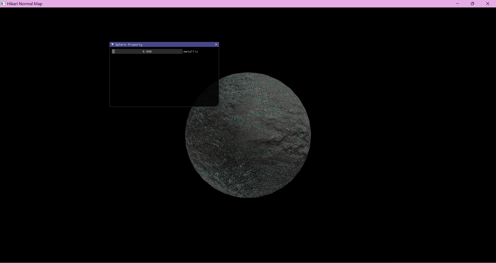

简单集成了一下IMGUI，可以不用硬编码了！

### 13.Normal Map

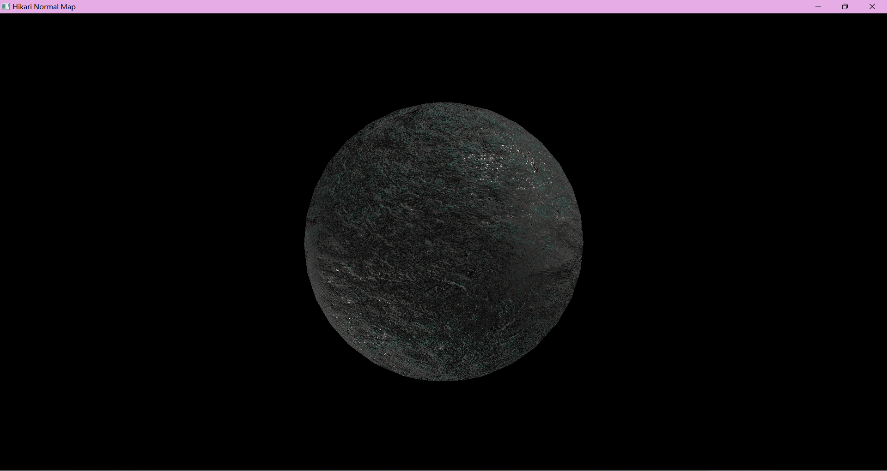

PBR加持的法线纹理。实现的时候是用TBN矩阵把法线从切线空间转换到世界空间计算的。转换到切线空间感觉...挺麻烦...

### 11.PBR Environment

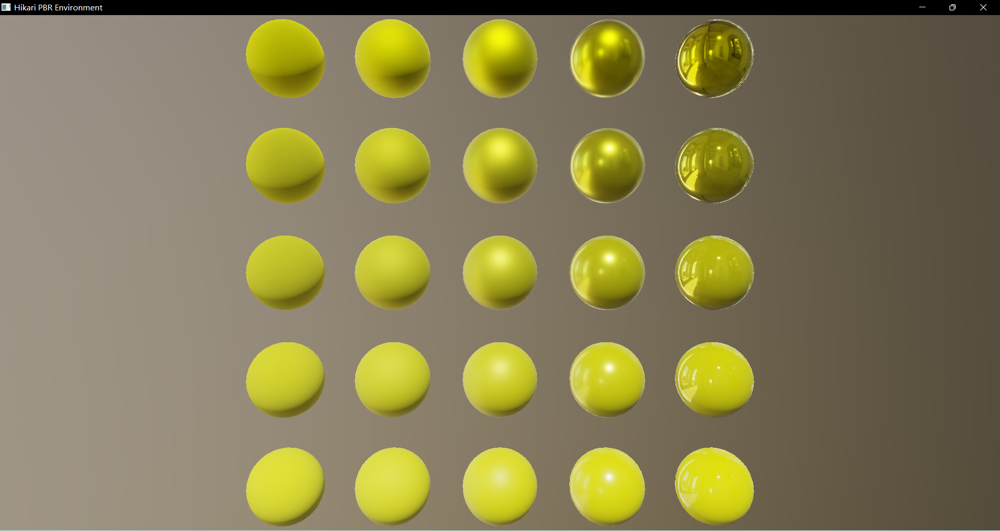

直接光照+IBL环境光=基于物理的渲染！（还差个相机...）

PBR的高楼已经建成了，但是上面还飘着朵乌云...（老问题，左上角高粗糙度下的金属球太暗了）

### 10.BRDF Lut

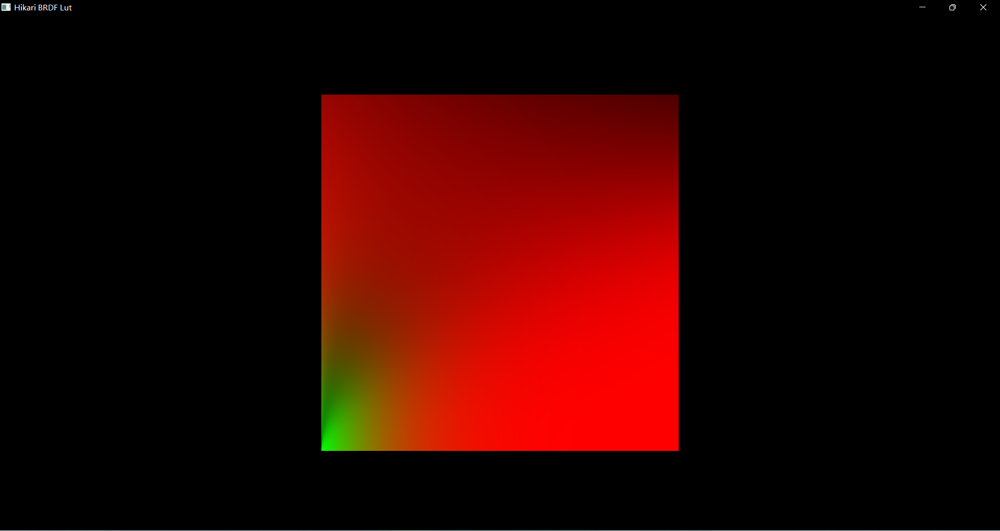

**注意：** 需要加载资源

使用Split-Sum Approximate将渲染方程拆成了两部分，第二部分是BRDF积分计算，这是一个带有4个参数的积分，不过人们发现，将Schlick近似（GGX Schlick和Fresnel Schlick）带入化简后，积分维度会降到二维，可以预计算，最终结果就是这张Lut（Look Up Texture）

### 9.Prefilter Environment Map

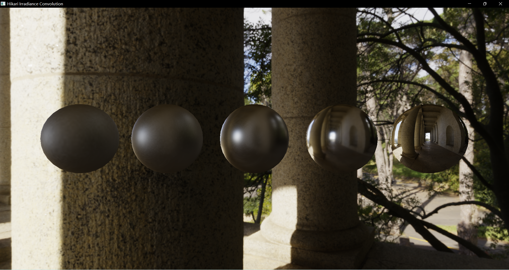

**注意：** 需要加载资源

使用Split-Sum Approximate将渲染方程拆成了两部分，第一部分是环境光在半球上的积分，这部分可以预计算。我们知道法线分布函数的lobe随着粗糙度变大而变大，也就是需要采样更大范围的环境光。mipmap就很适合来储存这样的环境光贴图，mipmap level表示粗糙度，各个level间还可以插值。

### 8.Diffuse Irradiance

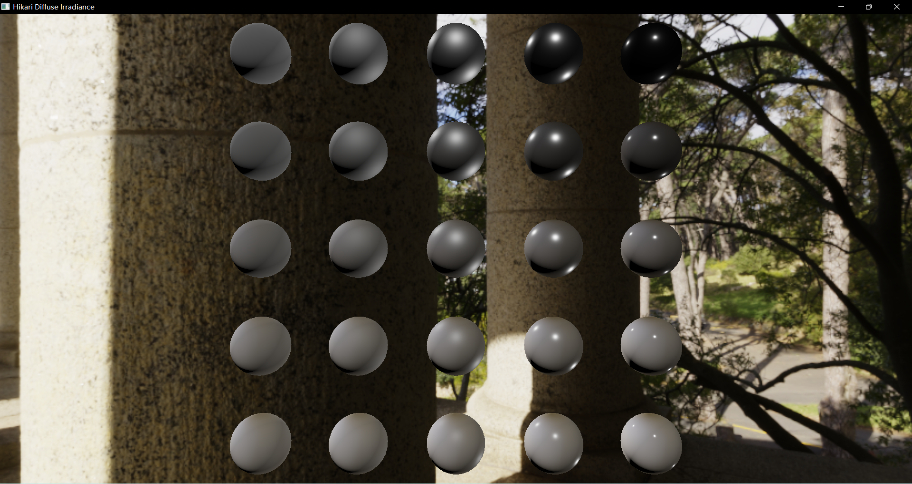

**注意：** 需要加载资源

使用预计算好的Irradiance Map替换掉漫反射计算，球体在环境中更加和谐了。但是，高光仍然只有来自点光源的反射，而且，高金属度高粗糙度下（也就是左上角的球）仍然没有实现多次散射能量补偿，看起来更加暗一些

### 7.Irradiance Convolution

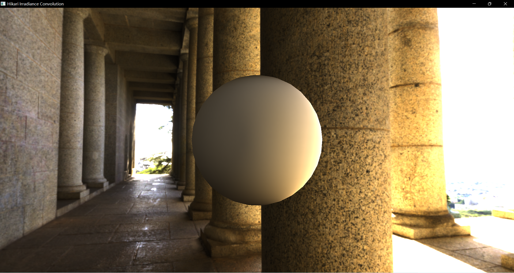

**注意：** 需要加载资源

先将Spherical Map转换成Cube Map，再从整个Cube Map上选取所有方向，每个方向的半球上均匀采样，卷积，sinTheta作为权重

### 6.PBR Direct Light

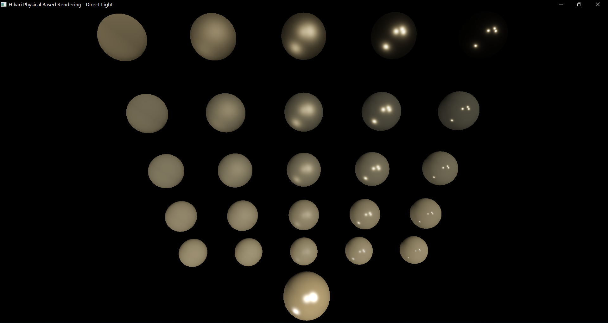

**注意：** 需要加载资源

直接光PBR

microfacet模型，使用Cook-Torrance BRDF，法线分布和几何遮蔽使用GGX近似，fresnel使用Schlick近似（金属和塑料统一近似处理），没有实现多次散射能量补偿（Multiple Scattering Microfacet BRDF），实际上高粗糙度下有能量丢失，颜色是比较暗的

（Tonemapping直接从learn opengl抄的超简单的一个实现）

（最下面那个球是blinn-phong做对比）

### 5.Multi Light

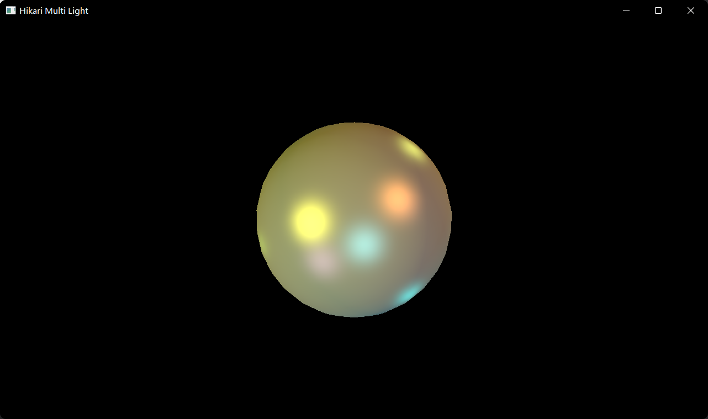

**注意：** 需要加载资源

非常简单的多光源，每次打开程序光源方向、颜色都不一样~光源还会自己动

### 4.Shadow Map

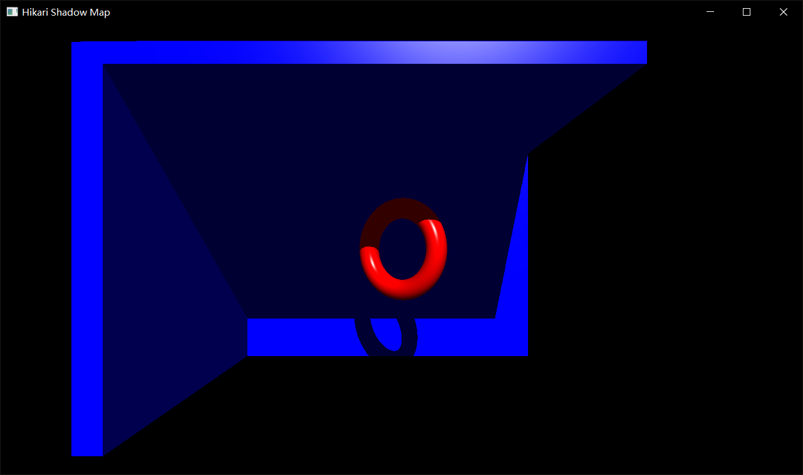

**注意：** 需要加载资源

非常简单的shadow map，截图看上去锯齿还好？高分辨率深度图出奇迹（红圈圈会自己转动

### 3.Blinn Phong

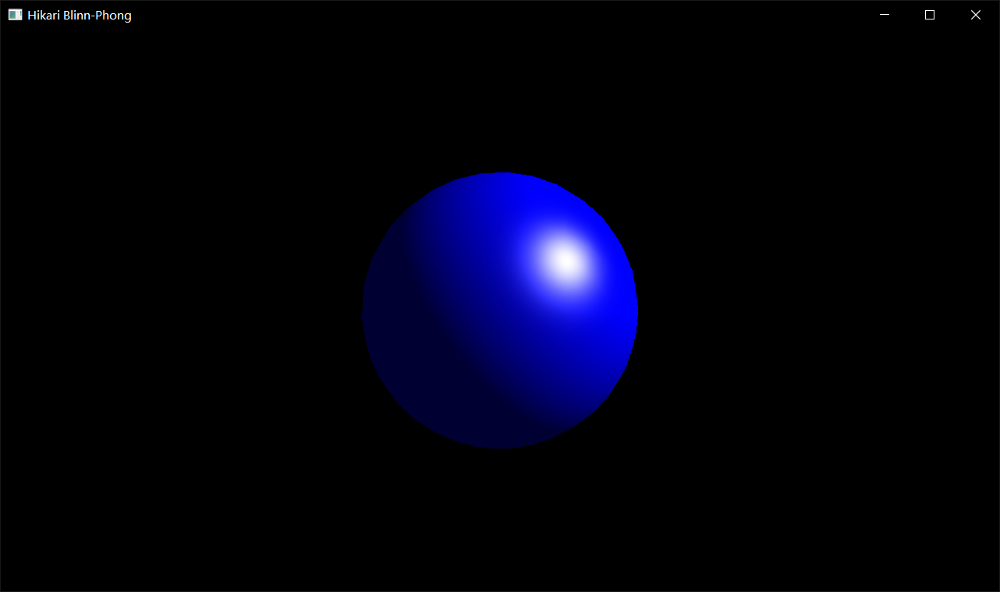

directional light，超级简单的blinn phong高光模型。场景同样可以查看四周（操作看2.Sky box

### 2.Sky box

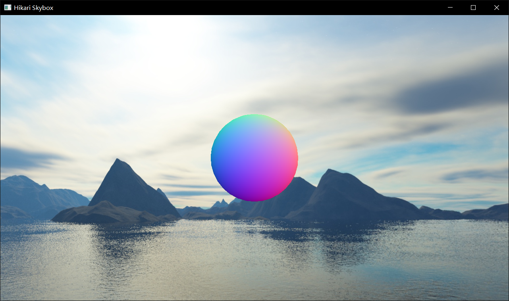

**注意：** 需要加载资源

天空盒和法线可视化，可以在窗口中按住鼠标左键查看四周，右键可以改变视角，滑动鼠标滚轮可以缩放

### 1.Simple Triangle

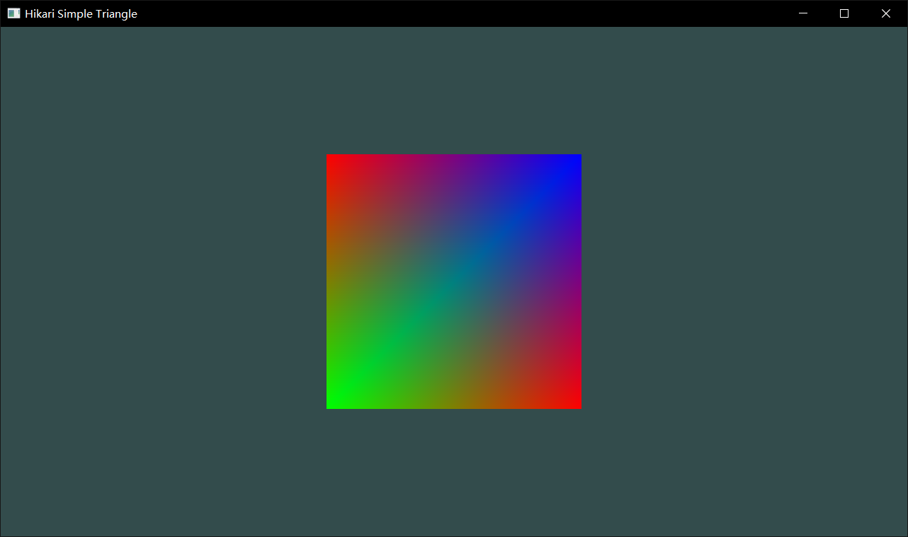

（triangle...?这tm不是矩形吗

### 0.Hello world

没啥好展示的，就一空白窗口（